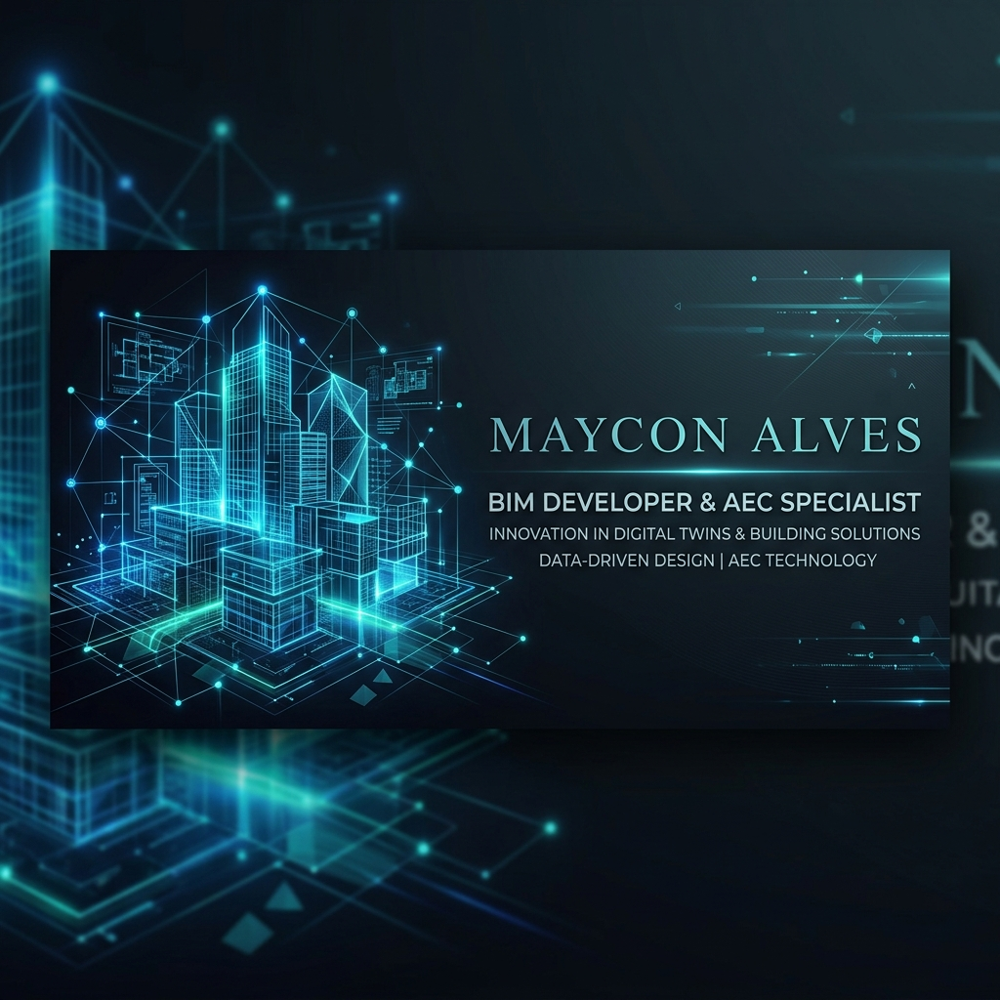

  
  
  # 🚀 Mission Tech Legacy
  ### BIM Developer | AEC Full-Stack | Digital Twins
  
  
  
  

---

## 🕊️ Uma Jornada de Fé e Propósito (2026 - 2028)

  

Atualmente, estou servindo como missionário em tempo integral para **A Igreja de Jesus Cristo dos Santos dos Últimos Dias**. Pelos próximos dois anos, dedicarei minha vida ao serviço ao próximo e ao compartilhamento de mensagens de esperança e fé.

Este repositório serve como um "farol" do meu trabalho técnico até este momento. Embora minhas mãos estejam ocupadas com a obra do Senhor, meu legado no desenvolvimento para a indústria AEC (Arquitetura, Engenharia e Construção) permanece vivo e aberto para a comunidade.

---

## 🏗️ Ecossistema de Projetos

Abaixo estão os pilares do meu trabalho, focados em transformar a indústria da construção através da tecnologia.

### 🧠 Inteligência Artificial & AEC
*   **[BIM-Lawyer](https://github.com/MayconAlvesss/BIM-Lawyer)**: Um sistema de auditoria normativa de alto desempenho. Utiliza IA para garantir que projetos estejam em conformidade com leis e regulamentações complexas.
*   **[AECAgent-RAG](https://github.com/MayconAlvesss/AECAgent-RAG)**: Agente autônomo especializado em engenharia, utilizando RAG (Retrieval-Augmented Generation) para responder consultas técnicas complexas com precisão.

### 🍃 Sustentabilidade & Engenharia Digital
*   **[EcoBIM-Logic](https://github.com/MayconAlvesss/EcoBIM-Logic)**: Motor de cálculo para sustentabilidade e WLCA (Whole Life Carbon Assessment), permitindo decisões de design baseadas em dados ambientais reais.
*   **[OpenIFC-DataWrangler](https://github.com/MayconAlvesss/OpenIFC-DataWrangler)**: Ferramenta robusta para extração e tratamento de dados de arquivos IFC, facilitando a interoperabilidade.

### 🌐 Digital Twins & Monitoramento
*   **[Nexus-Twin](https://github.com/MayconAlvesss/Nexus-Twin)**: Plataforma de Gêmeos Digitais que integra dados de sensores em tempo real para gestão eficiente de ativos.
*   **[SiteSense-AR](https://github.com/MayconAlvesss/SiteSense-AR)**: Monitoramento de canteiros de obras utilizando Realidade Aumentada, trazendo o modelo digital para o mundo físico.
*   **[AuraVision](https://github.com/MayconAlvesss/AuraVision)**: Visão computacional aplicada à detecção de patologias em estruturas, automatizando vistorias técnicas.

### 📊 Gestão & Dados
*   **[production-dashboard-ai](https://github.com/MayconAlvesss/production-dashboard-ai)**: Dashboard inteligente para monitoramento de produção industrial e ociosidade de maquinário.
*   **[BIM-to-Graph](https://github.com/MayconAlvesss/BIM-to-Graph)**: Conversão de modelos BIM em grafos espaciais para análises avançadas de topologia e rotas.

---

## 🛠️ Tecnologias de Domínio

- **Linguagens**: C#, Python, JavaScript, TypeScript.
- **BIM/AEC**: Autodesk Revit API, IFC.js, Speckle, Forge/Autodesk Platform Services.
- **AI/ML**: OpenAI API, LangChain, PyTorch, Computer Vision.
- **Frontend/Backend**: React, Next.js, Node.js, FastAPI.
- **Database**: PostgreSQL, Neo4j (Graph databases).

---

  
<i>"O conhecimento é o único tesouro que se multiplica quando compartilhado."</i>

  
Maycon Ricardo | mayconricardo2007@gmail.com

